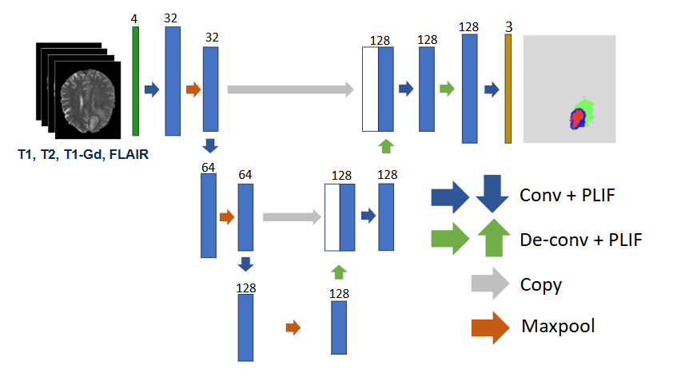

# Spiking U-seg Net for Brain Tumor Segmentation

Reliable energy-efficient spiking neural network for brain tumor segmentation.

This repository contains the code for the paper [Reliable Brain Tumor Segmentation Based on Spiking Neural Networks with Efficient Training](https://ieeexplore.ieee.org/document/11516057/metrics#metrics). The proposed method, referred to here as the **Spiking U-seg Net**, uses Forward Propagation Through Time (FPTT) to keep temporal learning efficient while reducing the computational cost of training spiking neural networks for semantic image segmentation.

## Installation

Before running any experiment, synchronize the environment from the project root with:

```bash
uv sync
```

If you do not have `uv` installed yet, follow the official installation instructions here: [Installation | uv](https://docs.astral.sh/uv/getting-started/installation/).

## Data

The project is evaluated on the multimodal BraTS benchmarks:

- BraTS 2017: https://www.kaggle.com/datasets/abdullahalmunem/brats17?resource=download
- BraTS 2023: https://www.synapse.org/Synapse:syn51514132

Download links are also listed in [data/data_download.txt](data/data_download.txt). After downloading the datasets, preprocess them with the scripts in [data/](data/).

## Training and testing

Run the experiments with the provided YAML configuration:

```bash
uv run python snn_fptt.py --config experiments_snn_fptt.yaml
```

The configuration file [experiments_snn_fptt.yaml](experiments_snn_fptt.yaml) controls the experiment setup, data paths, and training options.

## Architecture

The Spiking U-seg Net is a spiking U-Net style network built from convolutional and deconvolutional blocks with PLIF neurons and surrogate gradients. It processes multimodal MRI inputs slice by slice, aggregates temporal information with FPTT, and produces voxel-wise tumor segmentation outputs.

Main components:

- `ConvBlock`: convolution, normalization, and spiking activation.
- `DeconvBlock`: transposed convolution block for decoding, also followed by spiking activation.
- `SNNBraTS`, `SNNBraTSUNetShallow`, `SNNBraTSUNetMedium`, `SNNBraTSUNetDeep`: model variants with different encoder-decoder depths.

<div align="center">



</div>

## Citation

If you use this code in an academic context, please cite:

```bibtex
@INPROCEEDINGS{11516057,
	author={Ghiardelli, Aurora Pia and Tang, Guangzhi and Sun, Tao},
	booktitle={2026 IEEE 23rd International Symposium on Biomedical Imaging (ISBI)}, 
	title={Reliable Brain Tumor Segmentation Based on Spiking Neural Networks with Efficient Training}, 
	year={2026},
	volume={},
	number={},
	pages={1-5},
	keywords={Tumors;Modeling;Timing;Training;Dies;Uncertainty;Printing;Estimation;Spiking neural networks;Brain tumors;Brain Tumor Segmentation;Spiking Neural Networks (SNNs);Uncertainty Estimation;Forward Propagation Through Time (FPTT)},
	doi={10.1109/ISBI61048.2026.11516057}
}
```

## Notes

- Run everything from the repository root so `uv sync` and the experiment paths resolve correctly.
- The code is organized around the `snn_fptt.py` training script and the model definitions in [model.py](model.py).